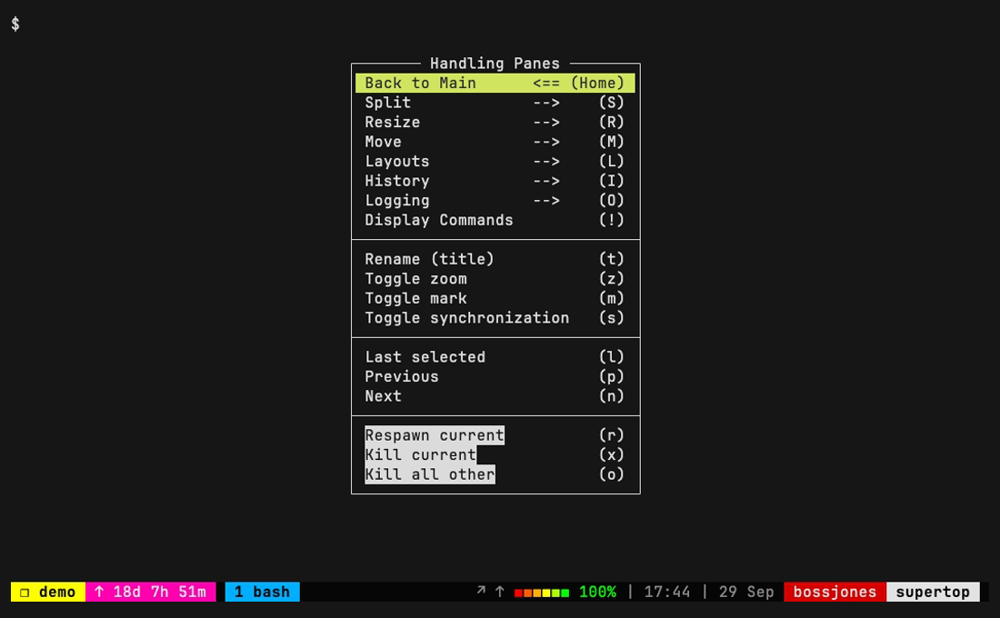
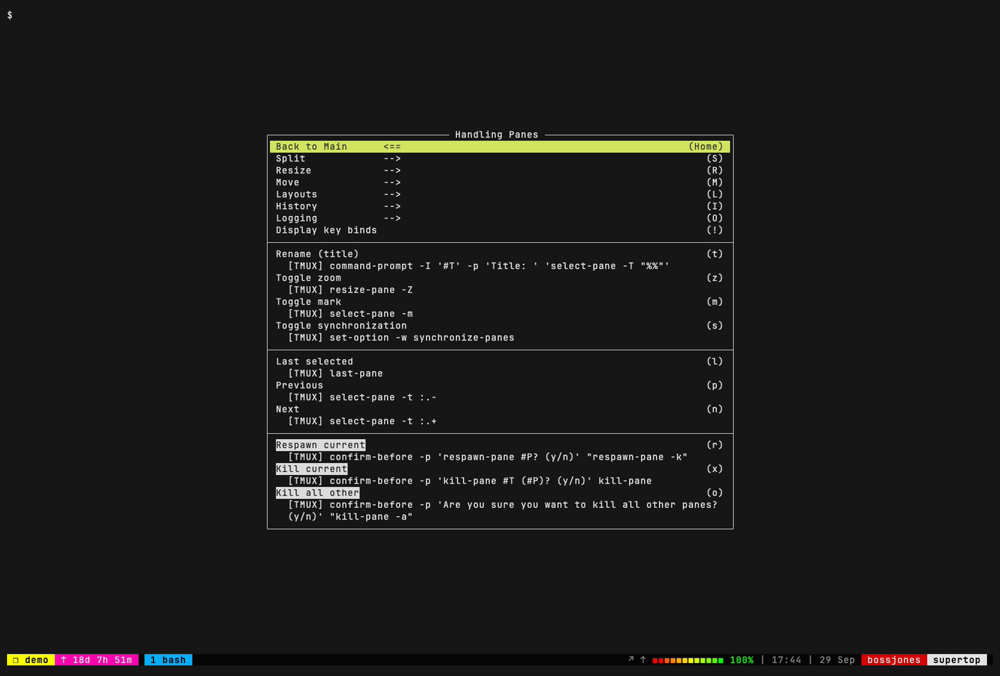
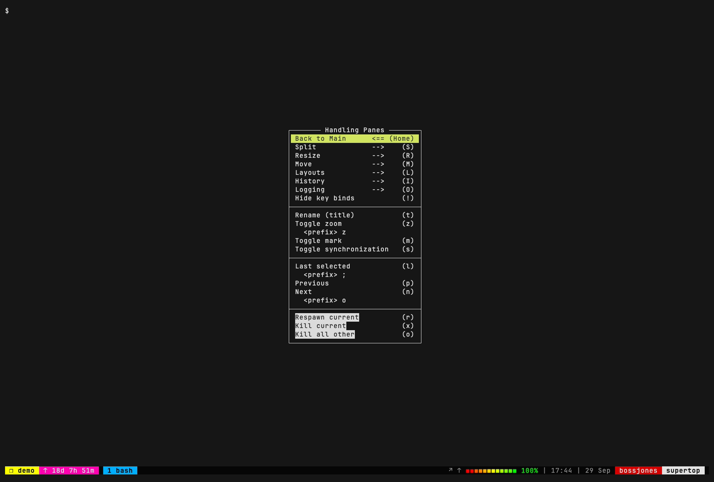
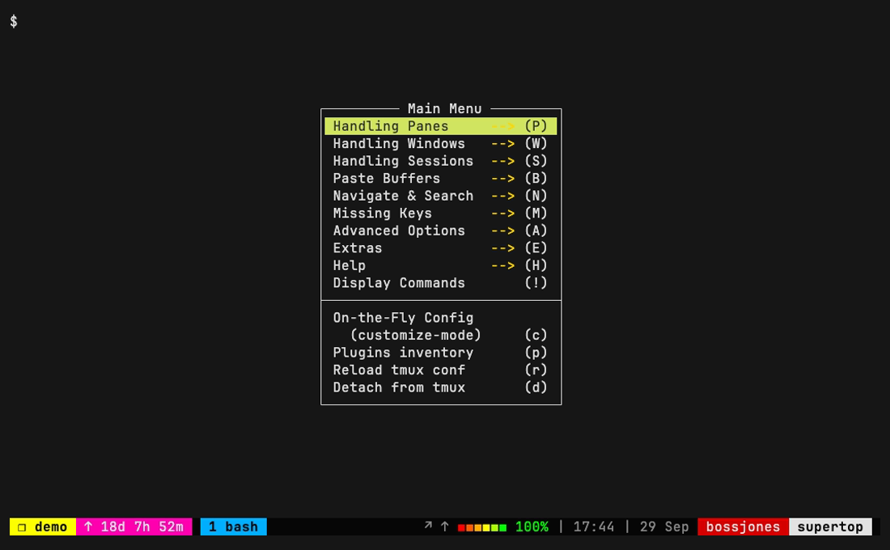
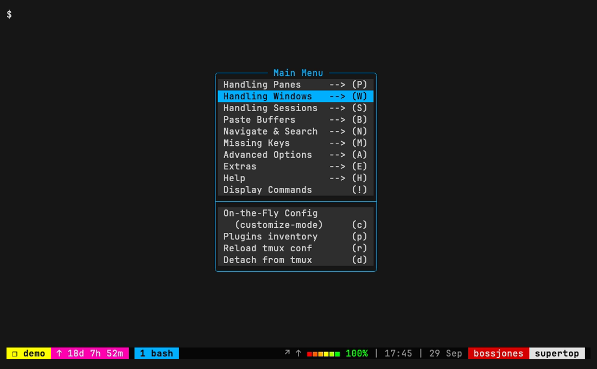
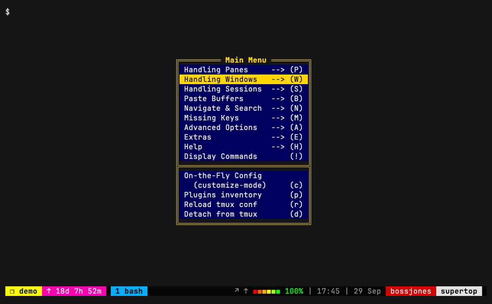
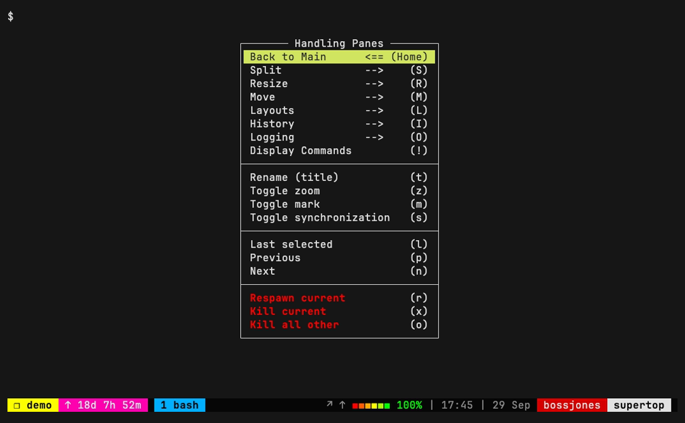

# tmux-menus in this config: what it looks like and how to style it

[jaclu/tmux-menus](https://github.com/jaclu/tmux-menus) is enabled in
[`.tmux.conf.local`](../../.tmux.conf.local) (see [`specs/tmux-menus.md`](../../specs/tmux-menus.md)
and issue [#8](https://github.com/bossjones/.tmux/issues/8)). Press **`<prefix> \`** to open it.

Every screenshot below is a **real render**: our `.tmux.conf` + `.tmux.conf.local`, the plugin at
tag `v2.4.1`, and tmux 3.5a, captured headlessly with [vhs](https://github.com/charmbracelet/vhs)
by [`render.sh`](render.sh). The status line is the actual oh-my-tmux theme. Only the snippet shown
in each section is added on top of our config.

> **Nothing in the "Styling options" section is enabled.** The config ships with the plugin's
> defaults. To adopt a style, copy its snippet into `.tmux.conf.local` right after
> `set -g @menus_trigger '\'`, then `<prefix> r`. tmux-menus drops its cache automatically when
> any `@menus_*` variable changes ([Advanced.md → Caching](https://github.com/jaclu/tmux-menus/blob/v2.4.1/docs/Advanced.md#caching)).

---

## Out of the box (current config)

### Main menu: `<prefix> \`


This uses tmux's stock menu colours. oh-my-tmux doesn't set any `menu-*` options, so the selected
row is tmux's default `menu-selected-style` (yellow background; the exact shade depends on your
terminal's palette). Press a letter to jump, or use arrows + Enter. `-->` marks a submenu.

### A submenu: `<prefix> \` then `P` (Handling Panes)



Destructive items (Respawn / Kill) are shown in **reverse video**. That's the plugin's default
"Danger Zone" style (`@menus_danger_zone`, default `#[reverse]`).

### "Show me the shortcuts": press `!` in any menu

`!` cycles through three views: normal → **tmux commands** → **key bindings** → normal
([README → Display Menu Commands](https://github.com/jaclu/tmux-menus/blob/v2.4.1/README.md#display-menu-commands)).

**First `!`: the tmux command behind each item**



**Second `!`: every prefix/root key already bound to that action** (e.g. `Toggle zoom` →
`<prefix> z`, `Next` → `<prefix> o`). Items with no binding show nothing. This is the view that
answers "what's the shortcut for X?"



> ⚠️ **Needs room.** These views are much bigger than the normal menu. In a 110×32 terminal the
> commands view **didn't render at all**. tmux-menus showed
> `tmux-menus ERR: items/panes.sh: Screen might be too small - menu closed after 0.0097…`, which is
> the tmux < 3.8 limitation described in
> [README → Screen Size Detection](https://github.com/jaclu/tmux-menus/blob/v2.4.1/README.md#screen-size-detection).
> The screenshots above were taken in a ~200×65 terminal. If you hit this, zoom the pane
> (`<prefix> z`), enlarge the window, or narrow the output with
> `set -g @menus_display_cmds_cols 60` (default `75`).

---

## Styling options

Styling works at three levels. From broadest to narrowest:

| Level | Options | Affects | Docs |
|---|---|---|---|
| tmux global | `menu-style`, `menu-selected-style`, `menu-border-style`, `menu-border-lines` | **every** tmux menu, including the right-click menus | [tmux(1) → menu-style](https://man.openbsd.org/tmux#menu-style) |
| tmux-menus only | `@menus_simple_style*`, `@menus_border_type`, `@menus_format_title` | only tmux-menus menus | [Styling.md → Style Variables](https://github.com/jaclu/tmux-menus/blob/v2.4.1/docs/Styling.md#style-variables) |
| accents | `@menus_nav_next/prev/home`, `@menus_danger_zone` | the `-->` / `<--` / `<==` markers and destructive items | [Styling.md → Navigation Indicators](https://github.com/jaclu/tmux-menus/blob/v2.4.1/docs/Styling.md#navigation-indicators), [README → Danger Zone](https://github.com/jaclu/tmux-menus/blob/v2.4.1/README.md#danger-zone) |

Per-menu overrides (`override_style`, `override_title`, …, set inside a menu script) also exist
for fine-grained theming. See [Styling.md → Per-Menu Overrides](https://github.com/jaclu/tmux-menus/blob/v2.4.1/docs/Styling.md#per-menu-overrides).

### A. Coloured navigation markers (the plugin author's own setup)

```tmux
set -g @menus_nav_next "#[fg=colour220]-->"
set -g @menus_nav_prev "#[fg=colour71]<--"
set -g @menus_nav_home "#[fg=colour84]<=="
```



This is the lightest touch: the `-->` markers turn yellow and nothing else changes. Taken from
[Styling.md → The styling I use](https://github.com/jaclu/tmux-menus/blob/v2.4.1/docs/Styling.md#the-styling-i-use).

### B. tmux-global menu style (matches the oh-my-tmux blue)

```tmux
set -g menu-style "fg=colour252,bg=colour236"
set -g menu-selected-style "fg=colour16,bg=colour39"
set -g menu-border-style "fg=colour39"
set -g menu-border-lines rounded
```



This gives a dark grey body, rounded borders, and a selection in `colour39`, close to oh-my-tmux's
`tmux_conf_theme_colour_4` (`#00afff`). Because these are **tmux** options, the right-click
pane/window/session menus get the same look, which keeps everything consistent. (Screenshot taken
after pressing ↓ once to show the selection colour.)

### C. tmux-menus-only style (plugin variables)

```tmux
set -g @menus_format_title "'#[align=centre] #[fg=colour220,bold]#{@menu_name} '"
set -g @menus_simple_style "fg=colour254,bg=colour17"
set -g @menus_simple_style_selected "fg=colour16,bg=colour220"
set -g @menus_simple_style_border "fg=colour220"
set -g @menus_border_type "double"
```



This styles **only** tmux-menus and leaves tmux's built-in menus alone. Notes from
[Styling.md](https://github.com/jaclu/tmux-menus/blob/v2.4.1/docs/Styling.md#style-variables):
- The `simple_style` variables only really support `fg`, `bg` and `default`.
- `@menus_format_title` is inserted unquoted, so keep the inner `'…'` quotes when the menu name
  can contain spaces.

### D. Custom Danger Zone colour

```tmux
set -g @menus_danger_zone "#[fg=colour196,bold]"
```



This makes Respawn / Kill items bold red instead of reverse video (compare with the
[default Panes menu](#a-submenu-prefix--then-p-handling-panes)). Set it to `""` to disable the
highlight entirely.

---

## Regenerating the screenshots

```sh
brew install vhs                      # pulls in ttyd + ffmpeg
git clone --depth 1 --branch v2.4.1 https://github.com/jaclu/tmux-menus /tmp/tmux-menus
TMUX_MENUS_SRC=/tmp/tmux-menus docs/tmux-menus/render.sh              # all variants
TMUX_MENUS_SRC=/tmp/tmux-menus docs/tmux-menus/render.sh 07-plugin-styles   # just one
```

To add a variant, add a case to `variant_keys` (the vhs key steps) and `variant_style` (the
snippet) in [`render.sh`](render.sh). Use `variant_size` if it needs a bigger terminal.

`render.sh` never touches your real tmux. Each variant gets its own socket (`-L shots-<name>`),
a temp `HOME`, a no-op TPM stub (no network), and a private copy of the plugin, and the server is
killed afterwards. It also **unsets every `TMUX*` environment variable** first. Run from inside
tmux, those variables point at *your* setup: `TMUX_SOCKET` makes oh-my-tmux's async setup
re-apply itself to your server, and `TMUX_PLUGIN_MANAGER_PATH` makes plugin install/uninstall act
on your real `~/.tmux/plugins`. `tests/conftest.py` clears them for the same reason (see the
comment in `_start_server`).
